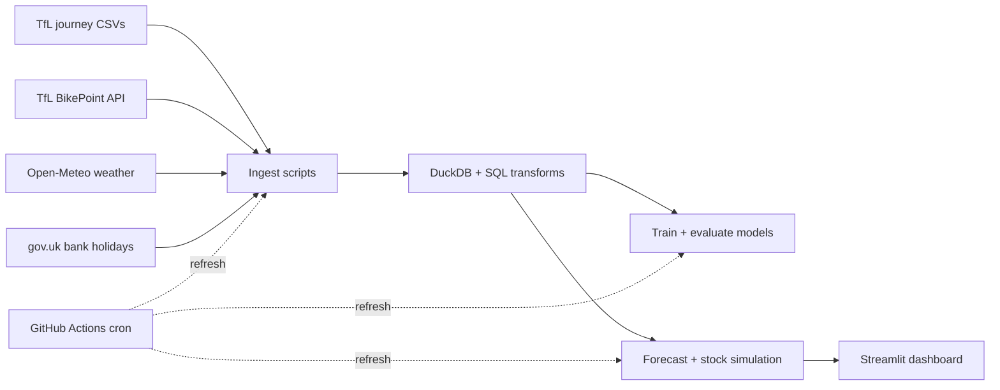

# London Bike-Hire Demand Forecaster

A Python forecasting project for London Santander Cycles usage, built around a 7-day demand forecast for every docking station in the TfL network. It ingests public TfL and weather data, trains a LightGBM model, and exposes results through an interactive Streamlit dashboard.

[](https://www.python.org/)
[](LICENSE)
[](https://streamlit.io/)

## Overview

This project estimates how many bikes will be leaving and arriving at each Santander Cycles station over the next 7 days, then simulates station stock to identify places that are most likely to run low on bikes or docks.

It uses public, no-key data sources:

- TfL journey history CSVs
- TfL BikePoint metadata (station location, capacity)
- Open-Meteo hourly weather
- UK bank holiday calendar

## Features

- End-to-end data pipeline: ingest → transform → train → forecast
- DuckDB warehouse with SQL transformations for station-hour demand tables
- LightGBM model benchmarked against a seasonal-naive baseline
- Forecast simulation of station stock over a 168-hour horizon
- Streamlit dashboard with:
  - station map by empty-dock risk
  - per-station 7-day demand chart
  - ranked risk table for the busiest trouble spots
- GitHub Actions refresh workflow for regular automation

## Architecture



## Quick start

### 1) Create a virtual environment

```bash
python -m venv .venv
# Windows PowerShell
.\.venv\Scripts\Activate.ps1
# macOS / Linux
source .venv/bin/activate
```

### 2) Install dependencies

```bash
pip install -r requirements.txt
pip install -e .
```

### 3) Run the full pipeline

This will ingest the data, build DuckDB tables, train the model, and generate the forecast outputs.

```bash
python -m bikeforecast.pipeline
```

Optional: backfill more history.

```bash
python -m bikeforecast.pipeline --weeks 104
```

### 4) Launch the dashboard

```bash
streamlit run dashboard/app.py
```

The dashboard reads the processed forecast files generated by the pipeline and is designed to work immediately when those outputs already exist in the repository.

## Project structure

```text
.
├── dashboard/
│   └── app.py
├── data/
│   ├── db/
│   ├── processed/
│   └── raw/
├── reports/
│   └── evaluation.json
├── src/
│   └── bikeforecast/
│       ├── ingest/
│       ├── models/
│       ├── transform/
│       ├── config.py
│       └── pipeline.py
├── .github/
│   └── workflows/
├── LICENSE
├── README.md
├── pyproject.toml
├── requirements.txt
└── .gitignore
```

## Model and validation

The project uses a 7-day-ahead forecasting setup, not a rolling 1-hour-ahead forecast. Features are restricted to information that is genuinely available for the whole forecast horizon, including:

- hour-of-day and day-of-week signals
- UK bank holiday flags
- weather variables
- lagged 168-hour demand patterns
- station-level historical averages

Validation is performed with a time-based holdout rather than random shuffling, which is important for temporal forecasting. The repository includes evaluation metrics in [reports/evaluation.json](reports/evaluation.json).

## Risk simulation

TfL does not publish historical dock occupancy data. To estimate where stations may run low on bikes or docks, the project simulates stock using the forecasted arrivals and departures:

```text
stock_t = clip(stock_{t-1} + arrivals_t - departures_t, 0, capacity)
```

Stations are flagged when simulated stock falls to 2 or fewer bikes, and the risk score is the fraction of the next 168 hours in that condition.

## Data sources

- TfL Cycling Data: public journey statistics
- TfL BikePoint API: station metadata and capacity
- Open-Meteo: hourly historical and forecast weather
- gov.uk: UK bank holiday calendar

## Automation

The project includes a scheduled GitHub Action to refresh the forecast and report outputs, which helps keep a deployed dashboard current without manual reruns.

## License

This project is licensed under the MIT License. See [LICENSE](LICENSE) for details.

## Contributing

Contributions are welcome. If you want to help improve the forecasting logic, dashboard, or data pipeline, open a pull request with a short explanation of the change.
