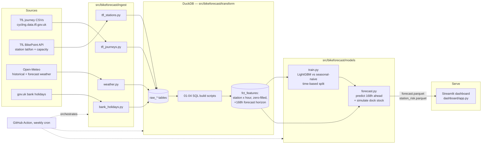

# London Bike-Hire Demand Forecaster

Hourly demand forecasting for TfL Santander Cycles docking stations, 7 days
ahead, with a dashboard that flags stations likely to run out of bikes (or
docks). Built on free, public data: TfL's published journey history and
Open-Meteo weather.

## What it does

- Ingests TfL's weekly/fortnightly journey CSVs, live station metadata, UK
  bank holidays, and hourly weather (historical + forecast) with no API keys.
- Builds a clean, zero-filled **hourly demand per station** table in DuckDB
  using plain SQL.
- Trains a LightGBM model per target (departures, arrivals) and compares it
  against a seasonal-naive baseline using **time-based validation** (train on
  the past, test on the most recent two weeks — never a random split).
- Simulates each station's dock occupancy forward across the forecast
  horizon and flags stations likely to run low on bikes.
- Serves it all through a Streamlit dashboard: a station map, a per-station
  7-day forecast, and a ranked "likely to run empty" view.
- Refreshes itself on a schedule via GitHub Actions.

## Architecture



Everything is driven by `python -m bikeforecast.pipeline`, which runs
ingest → DuckDB build → train → forecast in order (see
[`src/bikeforecast/pipeline.py`](src/bikeforecast/pipeline.py)).

## Quickstart

```bash
python -m venv .venv
source .venv/bin/activate  # .venv\Scripts\activate on Windows
pip install -r requirements.txt
pip install -e .

# Full run: ~8 weeks of journeys, build DB, train, forecast (~10-15 min)
python -m bikeforecast.pipeline

# Backfill more history (this project's own report used 14 weeks; TfL has
# data back to 2015, so --weeks 104 gets you ~2 years)
python -m bikeforecast.pipeline --weeks 104

streamlit run dashboard/app.py
```

The dashboard only reads `data/processed/forecast.parquet` and
`station_risk.parquet` — those two files (plus `reports/evaluation.json`)
are committed to the repo, so `streamlit run dashboard/app.py` works
straight after cloning without running the pipeline first.

## Data model

| Table | What it is |
|---|---|
| `stg_journeys` | Typed, cleaned journey rows (drops trips with an impossible duration) |
| `dim_stations` | One row per station: id, name, lat/lon, dock capacity |
| `fct_hourly_station_demand` | **(station × hour) grid**, zero-filled, departures/arrivals/net flow, extended 168h past the last real data as the forecast horizon |
| `fct_features` | The above + hour-of-day, day-of-week, bank holiday flag, weather, and lagged-demand features, ready to train on |

SQL lives in [`src/bikeforecast/transform/sql/`](src/bikeforecast/transform/sql/),
run in filename order by [`load_duckdb.py`](src/bikeforecast/transform/load_duckdb.py).

## Modelling approach

The brief is a **7-day-ahead batch forecast** — produced once, for the whole
week — not a rolling 1-hour-ahead forecast. That constrains which lag
features are legitimate: at forecast time you never have last week's
Tuesday-9am actuals *and* yesterday's, only whatever was known when the
forecast was made. So the feature set deliberately excludes 1h/24h lags and
uses only what's genuinely available 168 hours out:

- Calendar: hour of day, day of week, weekend flag, UK bank holiday flag
- Weather: temperature, precipitation, rain, wind, humidity (Open-Meteo
  forecast for future hours, actuals for historical training)
- `lag_168h` — same hour, exactly 7 days earlier (always a real observation
  for a 7-day horizon)
- A per-(station, hour-of-day, day-of-week) historical average, computed
  only from data before the evaluation cutoff (no leakage)
- `station_id` as a LightGBM categorical feature

### Results (14 weeks of journeys, test = most recent 2 weeks held out)

| Target | Seasonal-naive MAE | LightGBM MAE | Improvement |
|---|---|---|---|
| Departures/hour | 1.21 | 1.02 | 16% |
| Arrivals/hour | 1.19 | 0.98 | 17% |

Full breakdown by rain, weekday/weekend, bank holiday, and time-of-day is in
[`reports/evaluation.json`](reports/evaluation.json). Two findings worth
calling out:

- **Biggest win: bank holidays** (departures MAE 1.50 → 1.11, a 26%
  improvement). Seasonal-naive assumes "same hour last week," which is a bad
  assumption specifically when last week wasn't a holiday — exactly the case
  LightGBM's `is_bank_holiday` feature is built to catch.
- **Where it doesn't help: overnight hours (00:00–05:00).** LightGBM is
  marginally *worse* than the baseline here (0.261 vs 0.247 MAE). Overnight
  demand is already close to zero and highly regular, so there's little
  signal left for a more complex model to extract — the naive "same hour
  last week" is already close to optimal.
- Both models' absolute error is highest at evening peak (17:00–19:00,
  ~1.7–2.1 MAE) simply because that's where absolute volume — and its
  variance — is highest.

## "Likely to run empty" — how it's computed

TfL doesn't publish a historical time series of dock occupancy — only the
BikePoint API's *current* snapshot. So there's no ground truth to fit a
stock-level model against. Instead, `forecast.py` **simulates** it: each
station starts at 50% of its dock capacity, and for each forecast hour,
`stock = clip(stock + predicted_arrivals - predicted_departures, 0, capacity)`.
A station is flagged for an hour if simulated stock drops to ≤2 bikes. The
per-station **risk score** is the fraction of the next 168 hours flagged.

Read this as a **relative ranking**, not a calibrated probability — the
50%-start assumption means it's directionally right (which stations see
much more outflow than inflow) but the absolute stock numbers are not real
occupancy. In the current forecast, stations like Knightsbridge (Hyde Park)
and Lord's (St. John's Wood) — both leisure/park-adjacent — come out highest
risk, consistent with one-directional weekend leisure cycling that isn't
matched by return trips.

## Automation

[`.github/workflows/refresh.yml`](.github/workflows/refresh.yml) runs the
full pipeline (`--weeks 8`) every Monday and commits the refreshed
`forecast.parquet` / `station_risk.parquet` / `evaluation.json` back to the
repo — so a deployed dashboard (e.g. Streamlit Community Cloud pointed at
this repo) stays current without a server of its own.

## Limitations

- **TfL's own reporting lag.** Journey extracts lag real time by several
  weeks to months, so "the next 7 days" is relative to the latest data TfL
  has published, not necessarily today. `pipeline.py` always forecasts the
  168 hours immediately after the latest ingested journey.
- **City-wide weather, not per-station.** One Open-Meteo location (central
  London) is used for every station; local microclimate differences aren't
  modelled.
- **No real occupancy history**, as above — the "likely to run empty" view
  is a simulation from a neutral starting point, not a fit to observed stock.
- **Station identity drift.** A station's name/id can change slightly over
  the multi-year history; `dim_stations` picks the most frequently used name
  per id, which can occasionally paper over a genuine station move.
- **Bike-model mix ignored.** The data separates classic bikes from e-bikes;
  this project forecasts total trips only.
- Evaluated on 14 weeks of recent data for this write-up — a full 1–2 year
  backfill (`--weeks 104`) is supported and would give the model more
  seasons (winter vs summer demand) to learn from, at the cost of a much
  longer ingest.

## Project layout

```
src/bikeforecast/
  ingest/       TfL journeys, BikePoint stations, Open-Meteo weather, bank holidays
  transform/    DuckDB loader + SQL build scripts (staging -> dimensions -> facts -> features)
  models/       dataset prep, seasonal-naive + LightGBM training/eval, forecast + stock simulation
  pipeline.py   end-to-end orchestrator
dashboard/
  app.py        Streamlit app (map, per-station forecast, risk ranking)
.github/workflows/refresh.yml   weekly scheduled refresh
reports/evaluation.json         MAE report from the last training run
```
